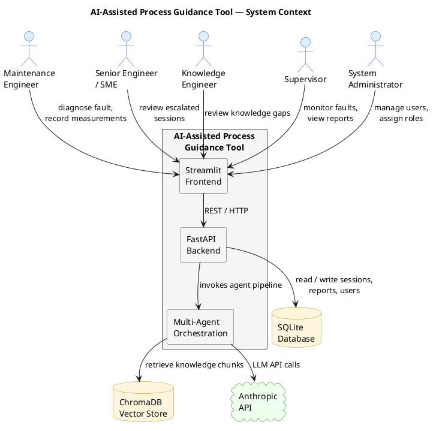
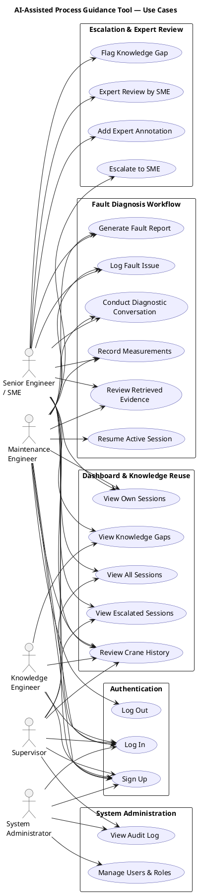
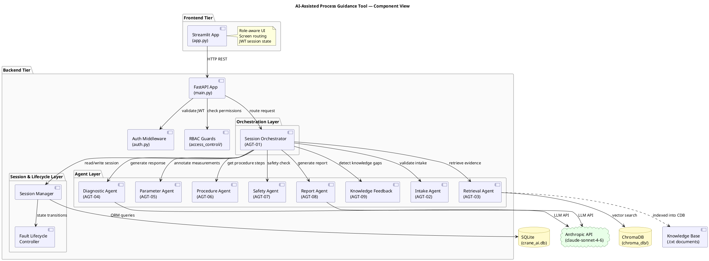
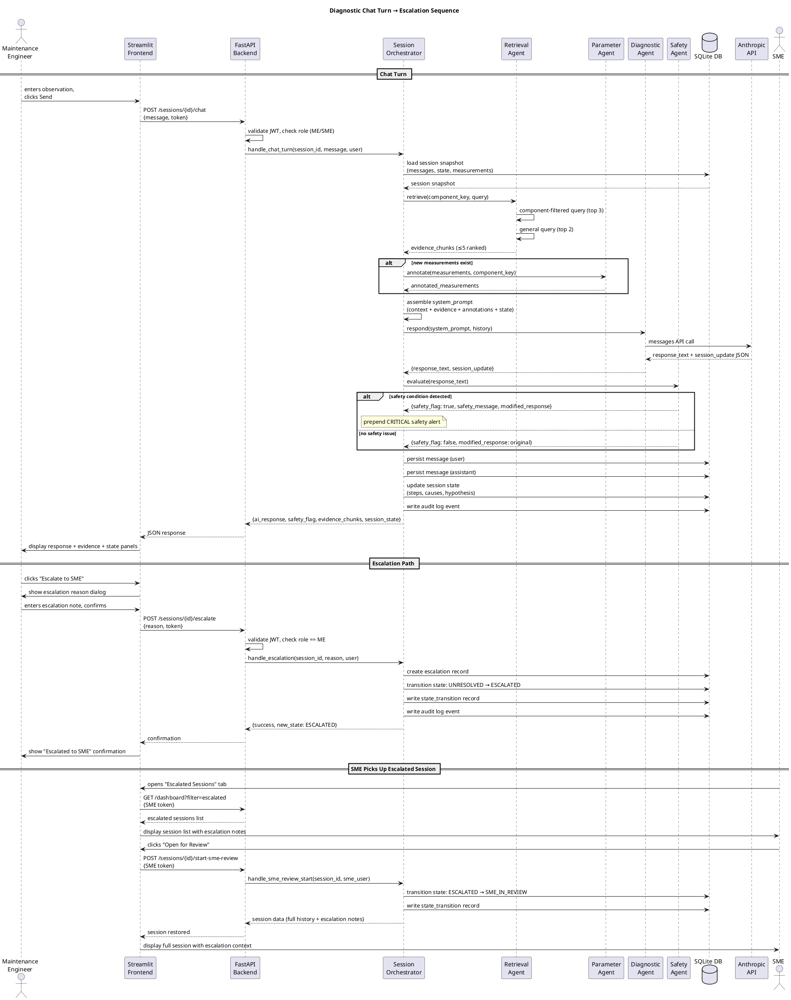
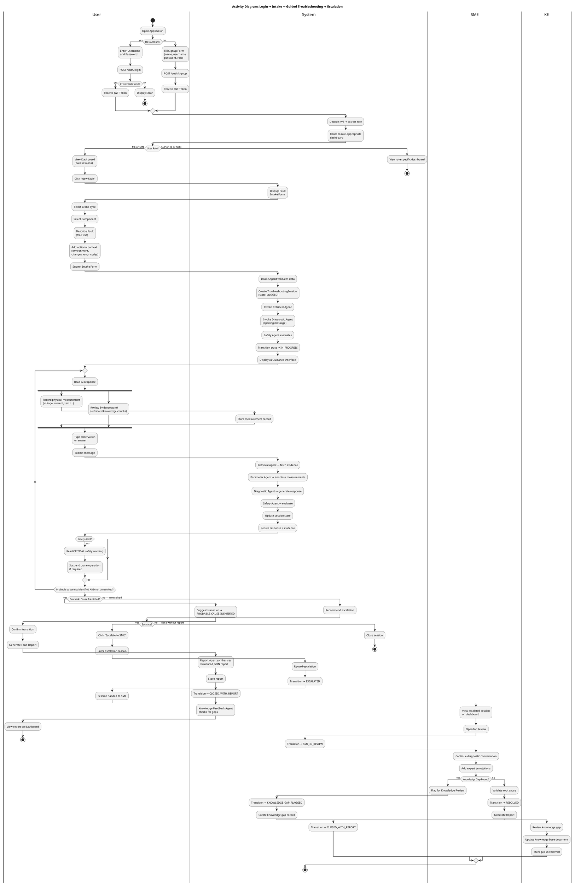
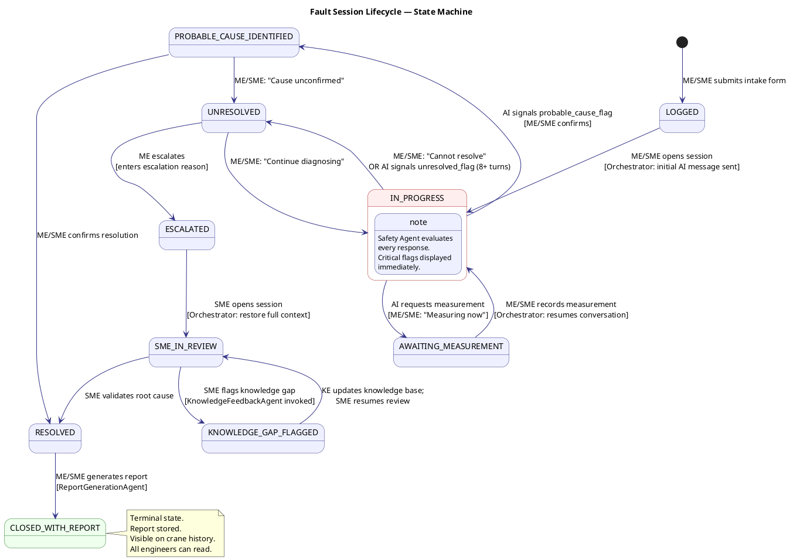
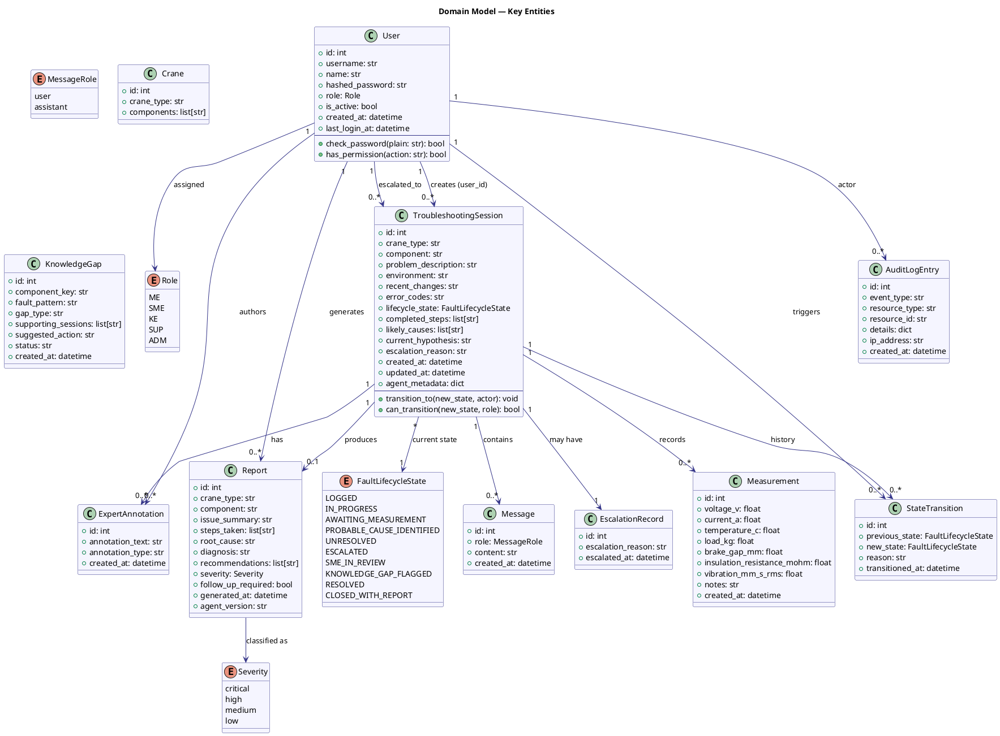

# UML_DIAGRAMS.md
# UML Diagram Reference — AI-Assisted Process Guidance Tool (Version 2)
# Master Thesis, RPTU / Fraunhofer IESE, 2025

This file provides descriptions, file references, and usage notes for all UML diagrams
associated with the system architecture. The actual PlantUML source files are located in
the `diagrams/` directory and can be rendered with PlantUML locally or via VS Code with
the PlantUML extension.

---

## Diagram Index

| File | Diagram Type | Purpose |
|------|-------------|---------|
| `diagrams/system_context.puml` | Context Diagram | Shows the system boundary and external actors |
| `diagrams/use_case.puml` | Use Case Diagram | All use cases grouped by actor and functional area |
| `diagrams/component_view.puml` | Component Diagram | Internal component structure and dependencies |
| `diagrams/sequence_troubleshooting_escalation.puml` | Sequence Diagram | Full chat-turn-to-escalation flow |
| `diagrams/activity_login_and_guidance.puml` | Activity Diagram | Login + intake + guided session + escalation workflow |
| `diagrams/fault_lifecycle_state.puml` | State Machine Diagram | Fault session lifecycle transitions with role labels |
| `diagrams/class_model.puml` | Class Diagram | Domain model with key entities and associations |

---

## 1. System Context Diagram

**File**: `diagrams/system_context.puml`

**Purpose**: Provides a high-level view of the system boundary. Shows which external actors interact with the system and what flows cross the system boundary. Useful for understanding the deployment context and integration points.

**Key elements**:
- The AI-Assisted Process Guidance Tool as the central system
- Human actors: Maintenance Engineer, SME, Knowledge Engineer, Supervisor, System Administrator
- External systems: Anthropic API (LLM), ChromaDB (vector store), SQLite (persistence)
- Data flows: engineer inputs, AI responses, knowledge retrieval, audit records

---

## 2. Use Case Diagram

**File**: `diagrams/use_case.puml`

**Purpose**: Provides a complete overview of all 21 use cases and which actors can perform them. Grouped by functional area. Useful for stakeholder communication and scope confirmation.

**Functional groupings**:
- Authentication and User Management
- Fault Intake and Session Management
- AI-Guided Diagnostic Workflow
- Escalation and Expert Review
- Knowledge Management
- Dashboard and Reporting
- System Administration

---

## 3. Component Diagram

**File**: `diagrams/component_view.puml`

**Purpose**: Shows the internal component structure of the backend, the multi-agent pipeline, and the frontend. Illustrates the interfaces between components and the data layer. Useful for implementation planning and code review.

**Key components**:
- Streamlit Frontend
- FastAPI Backend (API Layer, Auth Middleware, RBAC Guards)
- Session Orchestrator
- All nine AI Agents (AGT-02 through AGT-09)
- RAG System (ChromaDB + sentence-transformers)
- SQLite Database
- Anthropic API connection

---

## 4. Sequence Diagram: Troubleshooting Session with Escalation

**File**: `diagrams/sequence_troubleshooting_escalation.puml`

**Purpose**: Detailed end-to-end sequence showing the exact order of operations from the engineer submitting a chat message, through the multi-agent pipeline, to the response being displayed. Includes the escalation path where the session is handed to an SME. Useful for understanding the runtime behaviour of the system.

**Key scenarios shown**:
1. Engineer submits message
2. Orchestrator invokes Retrieval Agent → returns evidence
3. Parameter Interpretation Agent annotates measurements (if any)
4. Diagnostic Reasoning Agent generates response + session_update
5. Safety Agent evaluates and optionally flags
6. Orchestrator writes state to DB
7. Response returned to frontend
8. Engineer escalates → SME picks up and continues

---

## 5. Activity Diagram: Login, Intake, Guided Troubleshooting, and Escalation

**File**: `diagrams/activity_login_and_guidance.puml`

**Purpose**: Shows the complete workflow as a flow of activities, including decision points, parallel paths, and role-based branching. Covers the full engineer journey from login to session closure or escalation. Useful for process documentation and thesis narrative.

**Activities covered**:
- User arrives at login screen
- Login or signup path
- Role-based dashboard routing
- New fault intake
- Iterative diagnostic conversation loop
- Measurement recording (parallel activity)
- Escalation branch
- Report generation and session closure

---

## 6. State Machine Diagram: Fault Lifecycle

**File**: `diagrams/fault_lifecycle_state.puml`

**Purpose**: Formal state machine showing all states in the fault session lifecycle, all valid transitions, the triggering role for each transition, and the terminal state. Useful for implementation of the state transition validator and for thesis documentation.

**States**: LOGGED, IN_PROGRESS, AWAITING_MEASUREMENT, PROBABLE_CAUSE_IDENTIFIED, UNRESOLVED, ESCALATED, SME_IN_REVIEW, KNOWLEDGE_GAP_FLAGGED, RESOLVED, CLOSED_WITH_REPORT

---

## 7. Class Diagram: Domain Model

**File**: `diagrams/class_model.puml`

**Purpose**: Shows the key domain entities, their attributes, methods, and relationships. Corresponds to the SQLAlchemy ORM models in `backend/models.py`. Useful for database design validation and for understanding the data model.

**Entities**: User, Role, TroubleshootingSession, Message, Measurement, Report, ExpertAnnotation, KnowledgeGap, StateTransition, AuditLogEntry, Crane, Component

---

## Rendering Instructions

### Option 1: VS Code PlantUML Extension
1. Install the "PlantUML" extension by `jebbs` in VS Code.
2. Set the PlantUML server in settings: `"plantuml.server": "https://www.plantuml.com/plantuml"` or install PlantUML locally.
3. Open any `.puml` file and press `Alt+D` to preview.

### Option 2: Local PlantUML JAR
```bash
# Install Java if needed
# Download plantuml.jar from https://plantuml.com/download

java -jar plantuml.jar diagrams/*.puml
# Generates PNG files alongside each .puml file
```

### Option 3: Online Rendering
Paste the content of any `.puml` file into: https://www.plantuml.com/plantuml/uml/

---

## PlantUML Inline Source

The PlantUML source for all diagrams is reproduced below for convenience and LaTeX inclusion.

---

### Diagram 1: System Context



---

### Diagram 2: Use Case Diagram



---

### Diagram 3: Component Diagram



---

### Diagram 4: Sequence Diagram — Troubleshooting Session with Escalation



---

### Diagram 5: Activity Diagram — Login, Intake, Guided Session, Escalation



---

### Diagram 6: State Machine — Fault Lifecycle



---

### Diagram 7: Class Diagram — Domain Model


